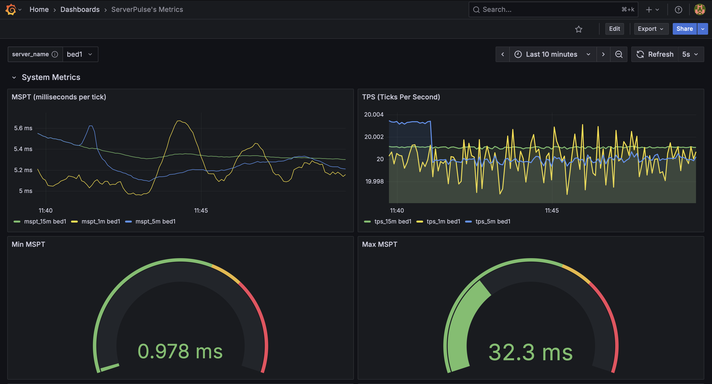
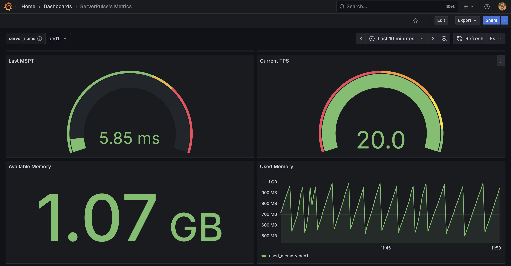
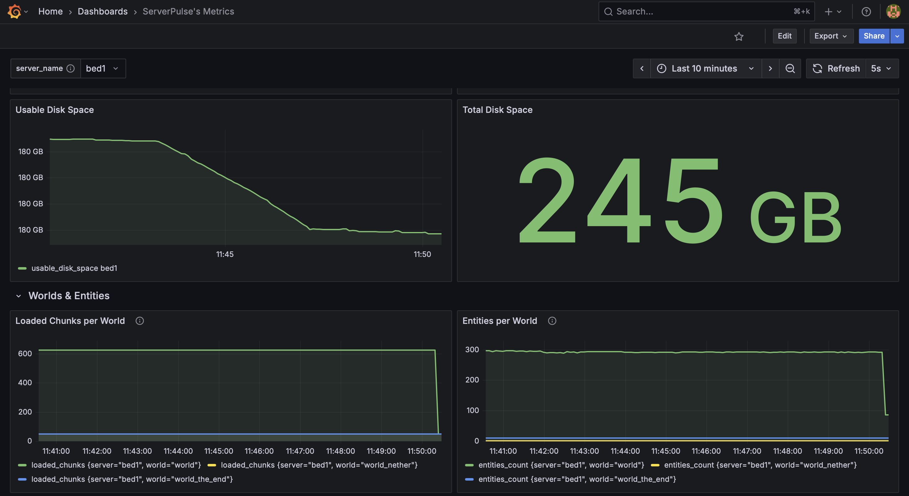
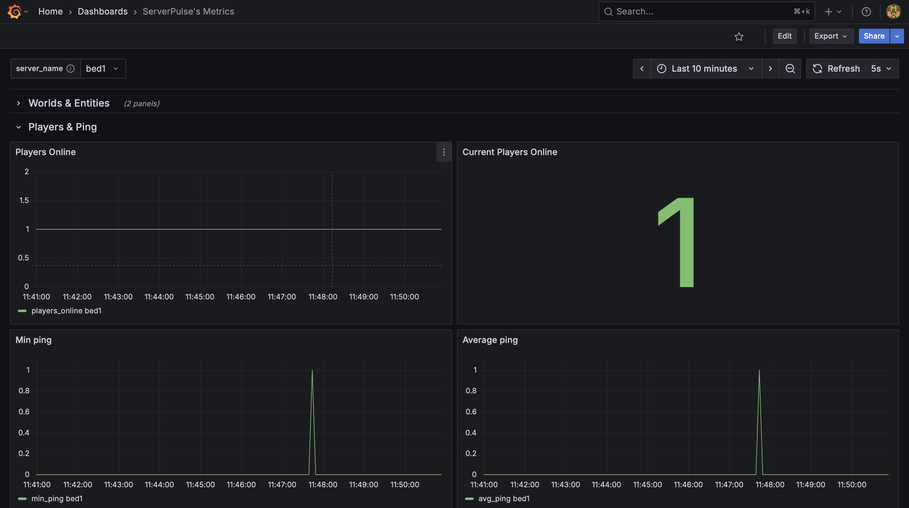

# ServerPulse

ServerPulse is an open-source, real-time performance monitoring tool for Minecraft servers. It collects key server metrics (TPS, MSPT, disk usage, memory, player count, entities, chunks, ping) and visualizes them through an integrated Grafana dashboard.

> ### 💬 Community & Support
>
> **Have questions, need help, or want to share your dashboard setup? [Click here to join our Discord Server\!](https://discord.gg/jZUqcemc4G)**

📊 View Dashboard Examples

*Example dashboard view 1: System Metrics*

*Example dashboard view 2: System Metrics 2*

*Example dashboard view 3: System & World Metrics*

*Example dashboard view 4: Player Metrics*

## 🚀 Why Choose ServerPulse?

ServerPulse isn't just another metrics exporter - it offers several unique advantages:

-   **Complete Monitoring Stack** - Fully integrated solution with InfluxDB (optimized for time-series data) and pre-configured Grafana dashboards.
-   **Universal Platform Support** - Works with any Bukkit-based, Velocity, and Fabric server while taking advantage of Paper-specific optimizations when available.
-   **Per-World Analytics** - Track entity counts, chunk loading, and performance metrics separately for each world.
-   **Flexible Tagging System** - Group and filter metrics by server, network, region, or any custom dimension through simple configuration.
-   **Zero-Configuration Dashboards** - Auto-provisioned Grafana dashboards, no manual setup required.
-   **Alert Notifications** - Integrated Discord and Telegram alerts for critical server metrics (TPS drops, memory issues, etc.).
-   **Production-Ready Infrastructure** - Built-in health checks, connection retry mechanisms, and proper error handling.
-   **Docker-First Deployment** - Single command deployment with Docker Compose for the entire monitoring stack.

## 🌟 Platform Support

ServerPulse supports **all Minecraft server platforms** in the ecosystem:

-   **Bukkit/Spigot**: Full support with custom TPS monitoring implementation.
-   **Paper and its forks** (Purpur, Pufferfish, etc.): Enhanced support with native TPS monitoring.
-   **BungeeCord**: Support for BungeeCord proxy servers with network-wide player monitoring.
-   **Velocity**: Support for Velocity proxy servers (ofc TPS and world metrics are not available).
-   **Fabric**: Support for Fabric servers (latest versions of Fabric API and Minecraft).

The plugin automatically detects your server platform and uses the most efficient implementation available for that environment.

## 📚 Documentation

**For setup guides, configuration instructions, API examples, and developer information, please visit our [Wiki](https://renvins.github.io/serverpulse/).**

The wiki contains comprehensive documentation on:
-   Installation and setup instructions
-   Configuration options and customization
-   Discord and Telegram alerts configuration
-   Developer API examples
-   Contributing guidelines

## 📊 Comparison with Alternative Solutions

| Feature                 | ServerPulse                          | Generic Prometheus Exporters                |
| ----------------------- | ------------------------------------ | ------------------------------------------- |
| Setup Time              | ~5 minutes with Docker Compose       | Manual metrics + Prometheus + Grafana setup |
| Dashboard Configuration | Pre-configured, auto-provisioned     | Manual dashboard creation                   |
| Data Storage            | InfluxDB (optimized for time-series) | Prometheus (general-purpose)                |
| Platform Support        | All Minecraft Servers                | Varies by implementation                    |
| Per-World Metrics       | Built-in                             | Usually not available                       |
| Custom Tagging          | Flexible tag system                  | Limited labeling                            |
| Alert System            | Discord and Telegram integration     | Requires manual setup                       |
| Infrastructure          | Complete stack included              | Manual integration required                 |
| Health Monitoring       | Automated health checks              | Varies by implementation                    |

## 🤝 Contributing

We welcome all contributions - bug reports, feature proposals, pull requests, or simply feedback. Read [Contributing](https://github.com/renvins/serverpulse/blob/master/CONTRIBUTING.md)

## 📄 License

ServerPulse is licensed under the GNU General Public License v3.0.
