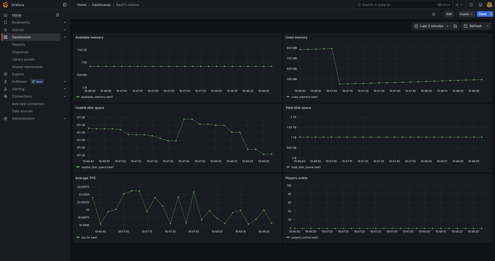
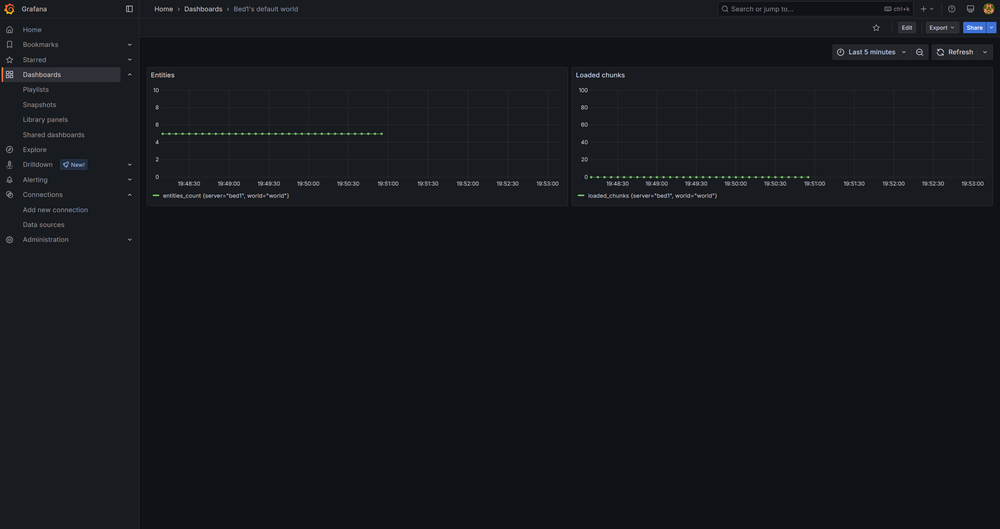

# ServerPulse

ServerPulse is an **open‑source**, real‑time performance monitoring tool for Paper Minecraft servers. It will collect key server metrics **(TPS, disk usage, heap memory, online player count, entities, chunks)** and store them in InfluxDB for visualization in Grafana.

<details>
<summary>📊 View Dashboard Examples</summary>


*Example dashboard view 1: General Server Overview*


*Example dashboard view 2: Per-World Details*

</details>

---

## 📖 What This Project Is

- **Goal:** Provide an extensible, lightweight plugin to gather server metrics and store them in InfluxDB for visualization with Grafana.
- **Tech stack:**
    - Java (Paper plugin) → InfluxDB
    - Grafana dashboard (preconfigured via provisioning)
    - Docker Compose (for InfluxDB & Grafana setup)

---

## Why Choose ServerPulse?

ServerPulse isn't just another metrics exporter - it offers several unique advantages:

* **Complete Monitoring Stack**: Unlike simple exporters, ServerPulse provides a fully integrated solution with InfluxDB (optimized for time-series data) and pre-configured Grafana dashboards
* **Per-World Analytics**: Track entity counts, chunk loading, and performance metrics separately for each world
* **Flexible Tagging System**: Group and filter metrics by server, network, region, or any custom dimension through simple configuration
* **Zero-Configuration Dashboards**: Auto-provisioned Grafana dashboards - no manual setup required
* **Production-Ready Infrastructure**: Built-in health checks, connection retry mechanisms, and proper error handling
* **Docker-First Deployment**: Single command deployment with Docker Compose for the entire monitoring stack

---

## 🚀 Getting Started

Follow these steps to set up and run the ServerPulse monitoring environment:

### Prerequisites

* Docker and Docker Compose installed on your machine.
* A Minecraft server running Paper (or compatible forks) where you can install the plugin.
* Git for cloning the repository (optional if you download the ZIP).

### 1. InfluxDB Setup and Token Configuration

The system uses InfluxDB to store metrics and Grafana to visualize them. Configuring an access token for InfluxDB is essential.

1.  **Start InfluxDB and Grafana Services:**
    In the `infra` directory of the project, run the command:
    ```bash
    docker compose up -d
    ```
    This will start the InfluxDB and Grafana containers in the background.

2.  **Access InfluxDB UI:**
    Open your browser and navigate to `http://localhost:8086`. Complete the initial InfluxDB setup if it's your first time launching it (create a user, password, and initial organization - you can use `my-org` as the organization name for consistency with the configuration files).

3.  **Create the Bucket:**
    Within the InfluxDB user interface, create a new **Bucket** named `metrics_db` (if it doesn't already exist from previous attempts). All metrics collected by the plugin will be stored here.

4.  **Generate an API Token:**
    Still in the InfluxDB UI, go to the API Tokens section and generate a new token. Ensure this token has **Read** and **Write** permissions for the `metrics_db` bucket. Copy this token; you'll need it in the next step. **Treat this token like a password; do not share it publicly.**

5.  **Update Configuration Files:**
    You need to configure both Grafana and the ServerPulse plugin:
    * **Grafana Datasource Configuration:** Edit the file `infra/grafana/provisioning/datasources/influx.yml`. Replace `my-token` with the InfluxDB API token you generated. **You must restart the Docker containers (`docker compose down && docker compose up -d`) for this change to take effect.**
    * **Plugin Configuration (`config.yml`):**
        * **Location:** The primary configuration file is `config.yml`. While you can edit the template at `plugin/src/main/resources/config.yml` before building, the standard way is to let the plugin generate the file on its first run inside your server's `plugins/ServerPulse/` directory, and then edit the *generated* file.
        * **InfluxDB Token:** Replace `my-token` under `metrics.influxdb` with your InfluxDB API token.
        * **Server Tag:** **Crucially, change the default `server: "bed1"` tag under `metrics.tags`** to reflect the actual name of your server (e.g., `server: "survival-1"`, `server: "lobby"`). This is essential for distinguishing metrics if you monitor multiple servers.
        * **Custom Tags:** You can add **additional custom tags** under `metrics.tags` as key-value pairs (e.g., `region: "eu"`, `network: "main"`). These tags will be attached to every metric sent to InfluxDB and can be used for filtering and grouping in Grafana. Example:
            ```yaml
            metrics:
              # ... other settings ...
              influxdb:
                # ... url, org, bucket ...
                token: your-influxdb-api-token-here
              tags:
                server: "your-server-name" # Change this!
                environment: "production"   # Example custom tag
                proxy: "velocity-1"       # Example custom tag
            ```
        *(Restart your Minecraft server or reload the plugin after editing `plugins/ServerPulse/config.yml` for changes to take effect).*

### 2. Build and Install the Plugin

1.  **Build the Plugin:** (If you don't already have the JAR file)
    Run the Gradle command to build the plugin JAR. From the project root directory:
    ```bash
    ./gradlew shadowJar
    ```
    You will find the resulting JAR file in `plugin/build/libs/`.

2.  **Installation:**
    Copy the ServerPulse plugin JAR file (e.g., `serverpulse-plugin-x.y.z.jar`) into the `plugins` folder of your Paper Minecraft server.

### 3. Start and Access

1.  **Start your Minecraft server.** The ServerPulse plugin will load. Ensure you have correctly configured the InfluxDB token and customized the `server` tag (and added any other desired tags) in `plugins/ServerPulse/config.yml`. The plugin will then start sending metrics to InfluxDB. Check the server console for status messages or errors.

2.  **Access Grafana:**
    Open your browser and navigate to `http://localhost:3000`.
    * The default credentials for Grafana are usually `admin` / `admin` (you will be prompted to change the password on first login).
    * The InfluxDB datasource and a preconfigured dashboard should be available. You might need to adjust the dashboard queries (or create new ones) to filter by the specific `server` tag you configured.

---

## 📝 Commands and Permissions

ServerPulse provides several commands to manage the plugin:

### Commands
- `/serverpulse status` - Check the connection status with InfluxDB
- `/serverpulse reload` - Reload the plugin configuration

### Permissions
- `serverpulse.status` - Permission to check InfluxDB connection status
- `serverpulse.reload` - Permission to reload plugin configuration

All command messages are customizable through the `config.yml` file and support color codes using the '&' symbol.

---

## 🎨 Custom Dashboards & Visualization

While ServerPulse provides a preconfigured dashboard as a starting point, the real power comes from creating your own visualizations in Grafana!

* **Explore Grafana:** Log in to your Grafana instance (`http://localhost:3000`) and explore its interface. You can edit the existing dashboard or create entirely new ones.
* **Create Panels:** Add new panels to your dashboards to visualize specific metrics. Grafana offers various panel types (graphs, gauges, tables, etc.).
* **Query Your Data:** When configuring a panel, you'll use the **InfluxDB datasource** and write **Flux queries** to retrieve the data. All metrics are in the `metrics_db` bucket, `minecraft_stats` measurement. Use the **tags** you configured (especially `server`, plus any custom ones) in your `WHERE` clause (or `filter()` function in Flux) to select the correct data.

Feel free to experiment and build dashboards tailored to the specific metrics and servers you care about most!

---

### Comparison with Alternative Solutions

| Feature | ServerPulse | Generic Prometheus Exporters |
|---------|------------|--------------------------|
| Setup Time | ~5 minutes with Docker Compose | Manual metrics + Prometheus + Grafana setup |
| Dashboard Configuration | Pre-configured, auto-provisioned | Manual dashboard creation |
| Data Storage | InfluxDB (optimized for time-series) | Prometheus (general-purpose) |
| Per-World Metrics | Built-in | Usually not available |
| Custom Tagging | Flexible tag system | Limited labeling |
| Infrastructure | Complete stack included | Manual integration required |
| Health Monitoring | Automated health checks | Varies by implementation |

---

## 🎯 Future Plans

We're actively developing new features to make ServerPulse even better:

- Plugin metrics API for third-party plugin integration
- Alert notifications system (Discord)
- BungeeCord/Velocity support for network-wide monitoring
- Advanced memory analysis and leak detection

---

## 🤝 Contributing

We welcome all contributions — bug reports, feature proposals, pull requests, or simply feedback.

1.  Fork this repository
2.  Create a feature branch (`git checkout -b feature/awesome-idea`)
3.  Commit your changes with clear, descriptive messages
4.  Open a Pull Request against `master`

Please follow the existing code style and conventions.
